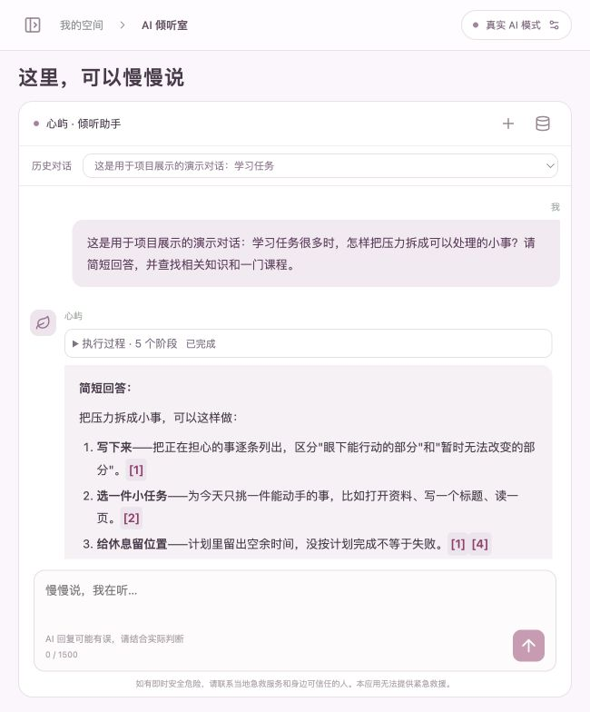
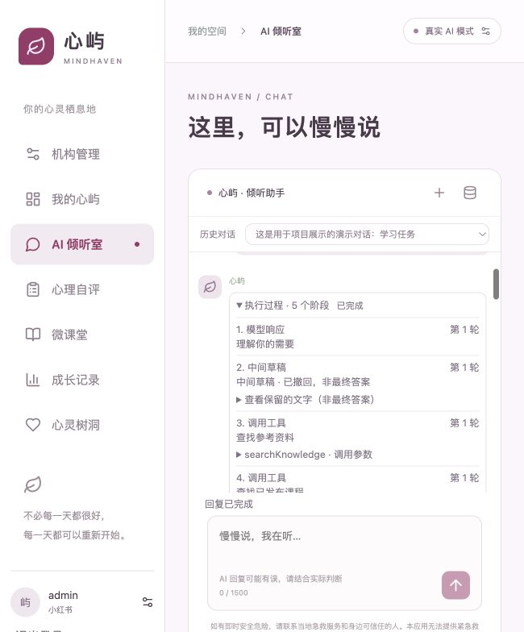
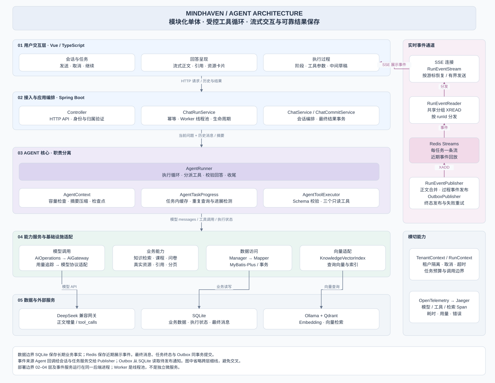

# Mindhaven · 心屿

由心屿 App 延伸而来的前后端演示项目，围绕心理科普、情绪记录和学习资源，探索 Agent、RAG 与 Web 应用开发。借助 AI 辅助实现，持续完善中。

## 界面预览

从对话到资料引用，再到工具调用过程，都可以在 AI 倾听室中查看。

| 对话与资料引用 | Agent 执行过程 |
| --- | --- |
|  |  |

<sub>实际界面截图，内容为项目展示用演示对话。点击图片可查看大图。</sub>

## 可以做什么

- **聊一聊**：流式对话、历史会话与停止生成；自动摘要压缩上下文，优先保留近期三轮对话，执行过程和中间草稿可展开回看。
- **按需查资料**：Agent 调用知识、课程和问卷工具，支持参数校验、分页、任务内缓存与重复查询检测；可恢复的工具错误返回模型处理。
- **让回答有据可查**：融合 BM25 与 Qdrant 向量检索，通过 RRF 排序，按主题和版本筛选资料，支持引用来源标识校验与原文回查。
- **做问卷、看课程**：问卷发布与填写、报告解读、视频课程与学习记录；推荐卡片来自实际查询到的资源。
- **记录心情、管理机构**：心情记录与私人树洞，机构成员与内容管理，按租户及用户隔离数据。
- **断线恢复与执行追踪**：Redis Streams + SSE 按游标补发事件，最终回答与 Outbox 通知同事务保存；通过 OpenTelemetry + Jaeger 查看模型和工具链路，记录耗时、Token 用量及提示词哈希。

## 技术栈

| 层次 | 技术 |
| --- | --- |
| 前端 | Vue 3、TypeScript、Vite、Vue Router |
| 后端 | Java 21、Spring Boot、Spring AI、MyBatis-Plus |
| 存储 | SQLite、Flyway、Redis Streams；可选 S3 兼容对象存储 |
| AI 与检索 | DeepSeek 兼容接口、Ollama、Qdrant、BM25 / RRF |
| 可观测性 | OpenTelemetry、Jaeger |

## Agent 架构



[查看大图](docs/diagrams/agent-architecture.svg) · [draw.io 源文件](docs/diagrams/agent-architecture.drawio)

后端采用 `Controller → Service → Manager → Mapper` 分层，模型、向量和存储通过 `integration` 接入。Agent 与事件服务运行在同一后端进程，Worker 使用任务线程池。

## 本地运行

准备 JDK 21+、Maven 3.9+ 和 Node.js 20.19+：

```bash
git clone https://github.com/shiyaojinwu/Mindhaven.git
cd Mindhaven
./start.sh
```

打开 http://127.0.0.1:5173 ，在登录页创建机构和管理员账号。默认使用 SQLite 和演示回复，无需模型密钥。macOS 也可双击 `start.command`。

| 命令 | 运行方式 |
| --- | --- |
| `./start.sh` | 演示回复 + BM25 |
| `./start.sh --ai` | 真实模型 + BM25 |
| `./start.sh --vector` | 演示回复 + 混合检索 |
| `./start.sh --live` | 真实模型 + 混合检索 |
| `./start.sh --check` | 检查依赖、配置和端口 |

接入真实模型时，参考 [.env.example](.env.example) 配置 `.env`。向量检索需要 Ollama 和 Qdrant，配置后在知识管理页面同步索引；使用 Redis 事件模式时需先安装 Redis，启动脚本会启动本地实例。

更多运行配置与使用说明见 [使用指南](docs/guide.md)。
